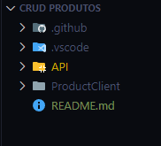
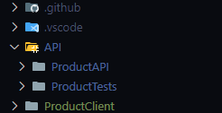
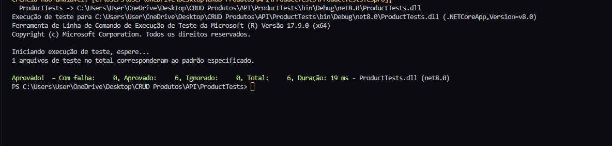
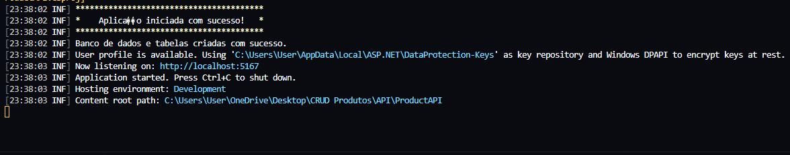
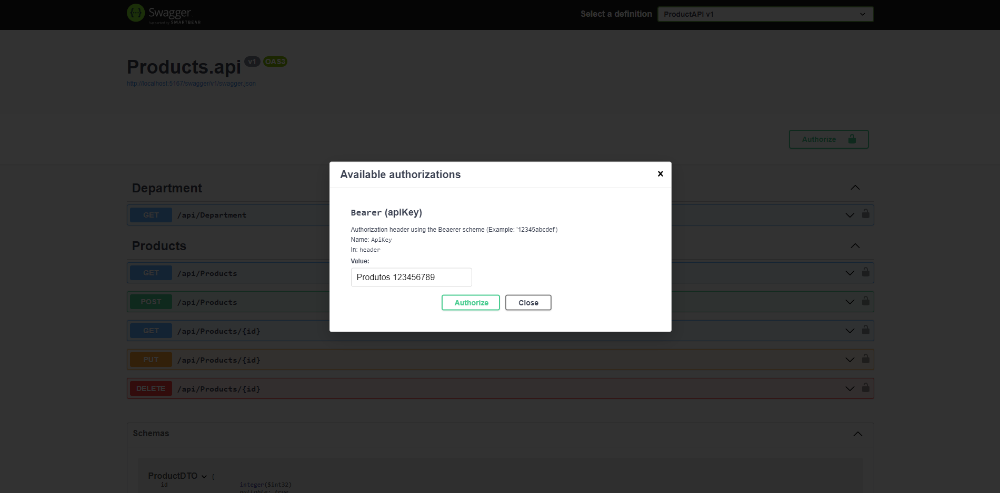

# CRUD Produtos

## Tecnologias do projeto

- [.NET SDK](https://dotnet.microsoft.com/download) (versão 8.0)
- [Node.js](https://nodejs.org/) (A partir da versao 14)
- [Angular CLI](https://angular.io/cli) (Versao 16)
- [MySQL](https://www.mysql.com/downloads/) (Versao 8)

## Instalação

### Backend (.NET Core)

Clone o repositório:

- Dentro da pasta desajada abra o terminal de seguinte comando: 

   ```bash
   git clone https://github.com/ElisbertoJunior/CRUDProducts.git

- Assim que o repositório for clonado aparecera as estrutura de pastas
    * API
    * ProcuctClient

    


- Dentro da pasta API esta o Server side(Back-end) da aplicacao
- Dentro da pasta ProductClient esta o Client side(Front-end) da aplicacao 

- Dentro da pasta API voce encontrara a as pastas
   * ProductAPI
   * ProductTests
     
   

- Dentro de ProductAPI navegue ate o arquivo appsettings.json e configure as duas strings 
de conexao de acordo com o local e as credenciais do seu MySQL
- Obs: No Program.cs eu explico por que de ter usado 2 strings de conexao

```json
"ConnectionStrings": {
    "DefaultConnection": "Server=localhost;Port=3306;Database=;User Id=seu_usuario;Password=sua_senha;Pooling=true;",
    "ConnectionRequests": "Server=localhost;Port=3306;Database=ProductDB;User Id=seu_usuario;Password=sua_senha;Pooling=true;"
}

``` 


* Nao e necessario criar o banco ProductDB antes de rodar a aplicacao, ela esta configurada para criar o banco automaticamente
caso ele nao exista assim que se conectar ao MySQL.

### Rodando testes

- Navegue ate a pasta ProductTests e dogite o seguinte comando para rodar os testes

```bash
dotnet test
```


### Rodando a API

- Para rodar a API basta navegar ate a pasta "ProductAPI" e digitar o seguinte comando
```bash
dotnet run
```



### Swagger

- Depois da aplicacao rodando para validacao no Swagger basta seguir link apresentado no 
console seguido de "/swagger/index.html"
[http://localhost:5167/swagger/index.html](http://localhost:5167/swagger/index.html)

- Os endpoints da API possuem um ApiKey que deve ser inserida no icone Authorize do Swagger
### ApiKey: Produtos 123456789

